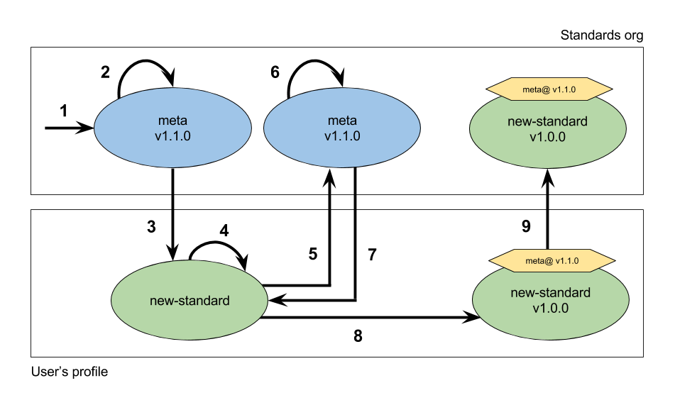
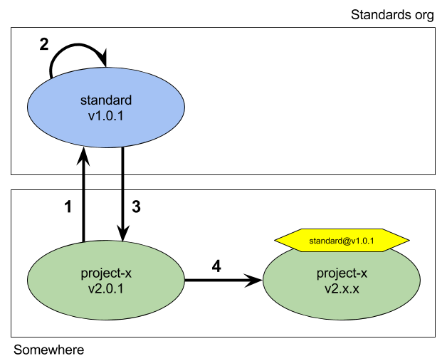

# Standard life cycle appendix
A standard is represented by a repository with certain documentation. That of course includes all features a GitHub repository offers, which defines a perfect environment for standards to live and grow healthy, like:
- [Issues] to bring up change proposals, ask for validation of a standard, propose a new standard, pretty much discuss everything related to a standard.
- [Tags] to version the standards using [semantic versioning] to keep track of which standard does a project complies and the changelog between those versions.
- [Pull requests] to bring up specific changes, ideally based on an Issue, to a standard.

That said, let's dig into how a standard is born.

## Let there be a new standard
First of all, the mother and father of any standard is the [Meta] standard. It does not simply serve as a "template" for new standards to get born, it also serves as the main hub where a standard should be proposed as an Issue in order to always get more than one opinion until finally it gets approved to be created by the community and by the Standards initiative team.

Now, you may think that that is too restrictive, but standards needs to be a controlled world. We can't let conflicting or similar standards live together, that will cause confusion and ultimately defeat the whole purpose of having the standards in the first place. Remember, standards is a community-driven initiative, that means that *any* standard should be able to get any kind of constructive feedback to change towards what the community is going.

Let's dive into the steps needed to create a standard:

1. A new GitHub Issue is created on the Meta standard
2. Some discussion needs to happen which involves all the community, not just Meta standard maintenance
3. The standard creation gets approved so it can be worked on 
4. A repository outside Standards organization should be created so people can work on the new standard
5. A new issue is created on the Meta standard to ask for validation
6. Some discussion could happen, feedback can be given to rework something
7. Eventually the new standard gets validated
8. The maintainers of the standard can create the first tag version and add the Meta standard badge
9. The new standard gets moved to the Standards organization

Now, these are the steps to comply with a standard:

1. A project that seeks compliance creates a Git Issue on the correspondent standard to ask for validation
2. The standard's validators proceeds to validate the project and give feedback
3. Eventually the project complies with the standard and the validation gets approved by the standard validators
4. The project can now include a badge to show complainance and possibly create a new tag version

Note that the compliance steps are basically steps 5 to 8 on the creation steps without the 9th step.

[Issues]: https://guides.github.com/features/issues/
[Tags]: https://git-scm.com/book/en/v2/Git-Basics-Tagging
[Semantic versioning]: http://semver.org/
[Pull requests]: https://help.github.com/articles/about-pull-requests/
[Meta]: ../README.md
